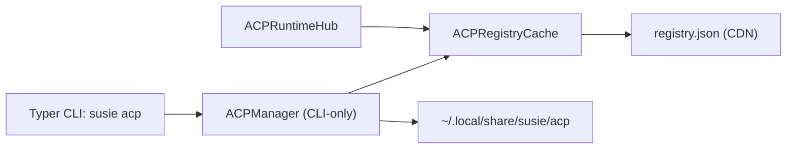

# Add ACP Registry Support

* Task: 260407T1402-add-acp-registry-support
* Author: [Huanan](https://github.com/AFutureD)
* Status: DRAFT
* Type: FEAT
* Related: []

## Background

Susie currently hard-codes ACP agents (e.g. `codex`, `kimi`) and does not support the ACP Registry yet.

Registry source:
- Registry JSON: https://cdn.agentclientprotocol.com/registry/v1/latest/registry.json
- Agent schema: https://cdn.agentclientprotocol.com/registry/v1/latest/agent.schema.json

A registry entry includes platform-specific binary distributions (e.g. `darwin-aarch64`) with `archive` URL + `cmd` to run after extraction.

## Goal

Add ACP Registry support so users can discover and install ACP agents and Susie can resolve `acp_id` via installed/available registry entries.

## Requirements (Functional)

### CLI

Add `acp` subcommand to the main CLI (`susie`):

1) List ACP agents
- List installed ACP agents
- List “not installed yet” ACP agents (registry entries not present locally / not found in PATH)
- List/search should be backed by the cached registry

2) Search ACP agents
- Search by substring across `id`, `name`, `description` (case-insensitive)

3) Install ACP agents
- Install by `acp-id` (registry `id`)
- Choose correct distribution for the current OS/arch
- Download archive, extract, and register as installed

### Registry cache
- Registry must be cached locally (do not fetch on every command run).
- Cache lives under `~/.local/share/susie` (see Paths below).
- Provide a CLI flag to force refresh (e.g. `--refresh`) and allow offline usage when cache exists.

### Install location
- ACP agents may be installed under `~/.local/share/susie` (see Paths below).

### Environment detection
- Detect already-installed ACP agents that were installed by other tools (e.g. Homebrew on macOS) by checking if the resolved executable exists on `PATH`.
- Such agents should be treated as “installed” even if not present in Susie’s install dir.

### Ownership / Module boundary
- All ACP registry + install + discovery logic must live under `src/susie/acp/`.
- Runtime MUST use `ACPRegistryCache` to resolve `AgentConfig.acp_id`.
- `ACPManager` is CLI-only and MUST NOT be used by runtime.

### `acp_id` (No Backward Compatibility) (Decision)
- `AgentConfig.acp_id` MUST be a registry `id` exactly (e.g. `codex-acp`, `kimi`).
- No legacy aliases (e.g. `codex`) are supported.
- The default agent config MUST be updated to use a registry id (expected: `codex-acp`).

## Architecture (Decision)

### Design Summary

Keep the implementation minimal with only two classes:

1) **Registry + cache**
- Class: `ACPRegistryCache`
- Focus: fetch/refresh registry, cache it, and expose:
  - the parsed `ACPRegistry` model
  - **platform-valid** ACP invocations as `ACPAgentConfig` (derived from registry `distribution.binary[platform].cmd`)

2) **ACP manager (CLI-only)**
- Class: `ACPManager`
- Focus: list/search/install ACP binaries and manifests.
- Used only by the CLI subcommand `susie acp ...`.

### Class Responsibilities

**ACPRegistryCache**
- `get_registry(refresh: bool) -> ACPRegistry`
  - When `refresh=true`, fetch from CDN and overwrite cache.
  - When `refresh=false`, read cache; if missing, fetch once (error if fetch fails).
- `get_valid_acp_configs(refresh: bool) -> dict[str, ACPAgentConfig]`
  - Compute current platform key (e.g. `darwin-aarch64`).
  - Filter registry agents to those that provide `distribution.binary[platform_key]`.
  - Parse `cmd` into executable token + args and return `ACPAgentConfig` keyed by registry `id`.

**ACPManager (CLI-only)**
- Constructed with an `ACPRegistryCache`.
- `list(mode: installed|available|all, refresh: bool) -> list[ACPAgentRow]`
  - “installed” includes:
    - Susie-managed installs under `~/.local/share/susie/acp`
    - PATH-detected installs (e.g. brew), based on resolving the executable implied by registry `cmd`
  - “available” = registry entries not installed (neither Susie-managed nor on PATH)
- `search(query: str, refresh: bool) -> list[ACPAgentRow]` (substring match on `id/name/description`)
- `install(acp_id: str, refresh: bool, force: bool) -> ACPInstallResult`
  - Uses registry entry + platform key to choose `archive` + `cmd`.
  - Downloads, extracts safely, creates stable runnable at `~/.local/share/susie/acp/bin/<acp-id>`.
  - Writes an install manifest for deterministic listing.

### Data Models (Decision)

**Registry-side models (used by `ACPRegistryCache`)**
- `ACPRegistry`: `{ version: str, agents: list[ACPRegistryAgent] }`
- `ACPRegistryAgent`: `{ id, name, version, description, distribution, (optional metadata...) }`
- `ACPRegistryDistribution`: `{ binary: dict[str, ACPRegistryBinary] }`
- `ACPRegistryBinary`: `{ archive: str, cmd: str }`
- `ACPRegistryCacheMeta`: `{ source_url: str, fetched_at: str, etag?: str, last_modified?: str }`
- `ACPPlatform`: `{ os: str, arch: str, key: str }`
- Existing: `ACPAgentConfig` (invocation spec derived from `cmd`: `acp_path` + `acp_args`)

**Install/CLI models (used by `ACPManager`)**
- `ACPInstallManifest`: `{ acp_id, version, platform_key, archive_url, cmd, cmd_tokens, installed_at, install_root, shim_path }`
- `ACPInstalledAgent`: `{ acp_id, version?: str, source: ACPInstallSource, exec_path: str }`
- `ACPInstallSource` (enum): `SUSIE_MANAGED` | `PATH`
- `ACPAgentRow`: `{ acp_id, name, version, description, installed: bool, source?: ACPInstallSource, exec_path?: str }`
- `ACPInstallResult`: `{ acp_id, version, shim_path, manifest_path }`

### Runtime Integration (Decision)
- Replace the hard-coded agent map in `ACPRuntimeHub.get_acp_config` with registry-based resolution via `ACPRegistryCache.get_valid_acp_configs(refresh=false)`.
- If `AgentConfig.acp_id` is not present in the returned dict, fail with an actionable error (unknown id vs not installed).

## Proposed CLI Interface (Decision)

- `susie acp list [--installed | --available | --all] [--refresh]`
  - default: `--all`
- `susie acp search <query> [--refresh]`
- `susie acp install <acp-id> [--refresh] [--force]`

Output should be human-friendly (Rich tables), but still scriptable (stable columns, no interactive prompts by default).

## Paths (Decision)

Introduce a Susie “data dir” distinct from the existing config dir (`~/.config/susie`).

- Data root: `~/.local/share/susie/`
- Registry cache:
  - `~/.local/share/susie/acp/registry/registry.json`
  - (optional) `~/.local/share/susie/acp/registry/meta.json` (etag/last_fetch timestamp)
- Install root:
  - `~/.local/share/susie/acp/agents/<acp-id>/<version>/...`
  - `~/.local/share/susie/acp/bin/<acp-id>` as a stable shim/symlink/copy to the runnable executable

If a registry entry’s `distribution.binary.<platform>.cmd` is `./foo`, then the installed runnable should end up as `.../acp/bin/foo` (or `foo.exe` on Windows).

## Error Handling (Decision)

- If registry cache is missing and fetch fails: show a clear error and exit non-zero.
- If cache exists but refresh fails: continue using cached registry and warn.
- If platform distribution is missing: error with supported platforms listed.
- If install target already exists and `--force` not set: error with hint.

## Acceptance Criteria / Scenarios

- `susie acp list --installed` shows:
  - agents installed under Susie data dir, plus
  - agents discoverable on PATH (e.g. `codex-acp` installed via brew), without duplicating entries
- `susie acp list --available` shows registry agents not installed locally and not found on PATH
- `susie acp search kimi` returns matching registry agents
- `susie acp install amp-acp` downloads the correct archive for macOS arm64, extracts it, and makes it runnable via Susie-managed path
- Setting `[[agents]].acp_id = "<registry-id>"` works without modifying code (runtime resolves via `ACPRegistryCache`, not `ACPManager`)

## Test Plan (Must-have)

- Unit tests for:
  - platform key selection mapping (darwin/linux/windows + arch mapping)
  - registry cache behavior (fresh vs cached, `--refresh`, offline fallback)
  - `cmd` parsing into `ACPAgentConfig` (token0 path + args)
  - manager installed detection (Susie-managed + PATH detection)
- CLI smoke tests (can be subprocess-based) for `list/search/install` using a mocked registry + local file server (no real network in tests).

## Notes / References

- Current hard-coded ACP list lives in runtime hub and should be replaced by registry-based resolution via `ACPRegistryCache`.
- Registry schema is available at:
  - https://cdn.agentclientprotocol.com/registry/v1/latest/agent.schema.json
